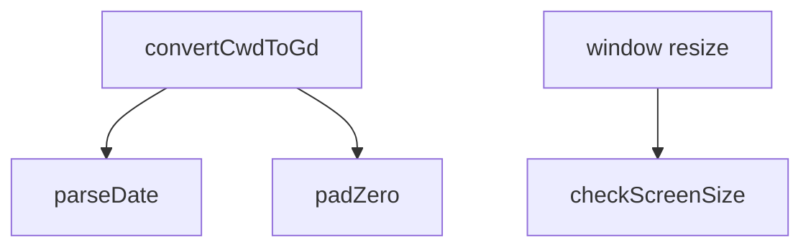
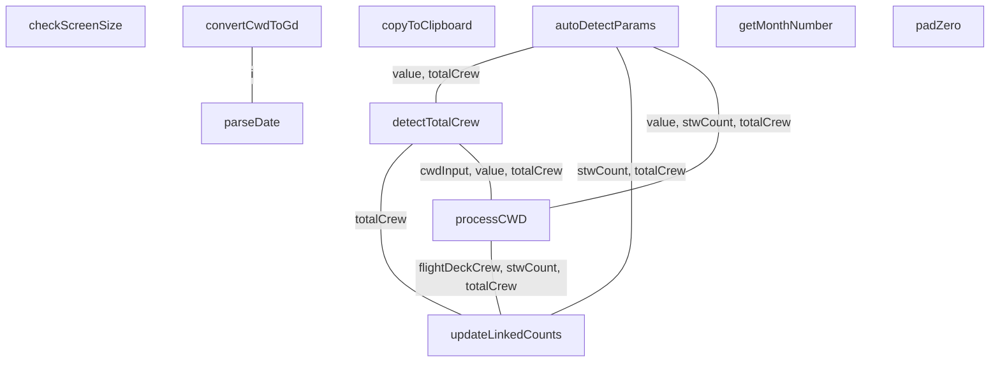

# CWD to GD Converter Function Documentation

This documentation provides detailed information about the functions in the CWD to GD Converter application.

## Functions

- [autoDetectParams](./autoDetectParams.md) - Function to auto-detect parameters based on content
- [checkScreenSize](./checkScreenSize.md) - It's for dynamic adjust font size and add events to controls
- [convertCwdToGd](./convertCwdToGd.md) - It's for converting CWD to GD format
- [copyToClipboard](./copyToClipboard.md) - It's for copying data to clipboard
- [detectTotalCrew](./detectTotalCrew.md) - Function to detect total crew count from CWD
- [getMonthNumber](./getMonthNumber.md) - It's for getting month names to numbers
- [padZero](./padZero.md) - It's for padding numbers with leading zeros
- [parseDate](./parseDate.md) - Helper functions
- [processCWD](./processCWD.md) - It's for processing
- [updateLinkedCounts](./updateLinkedCounts.md) - Function to update linked counts to maintain total

## Function Call Graph

## Function Relationships Through Shared Variables

